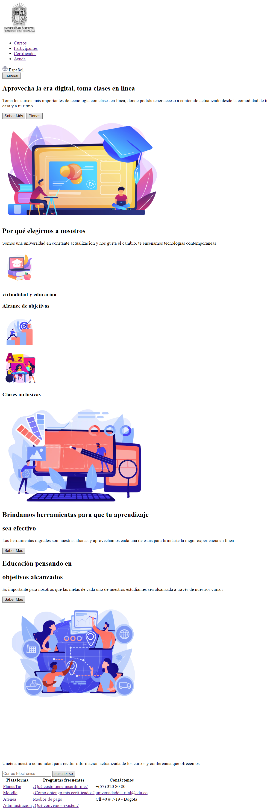
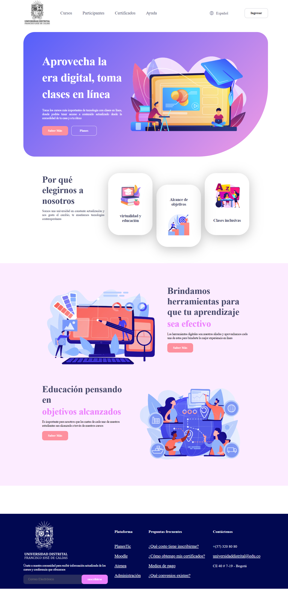
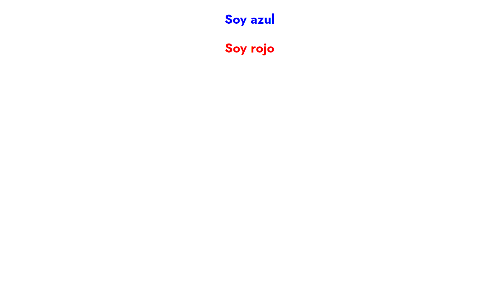
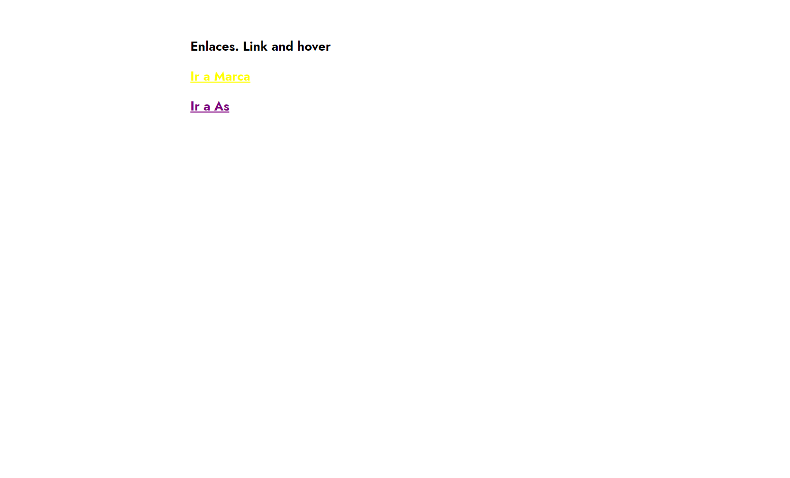
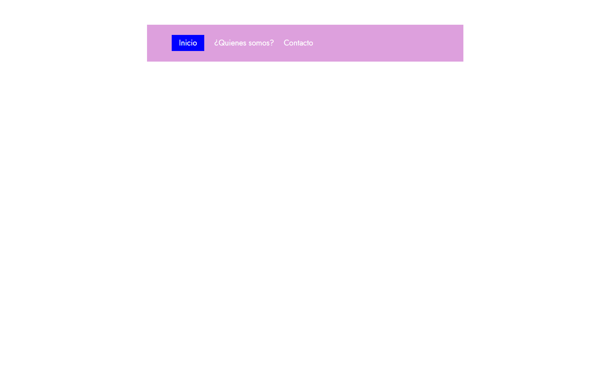
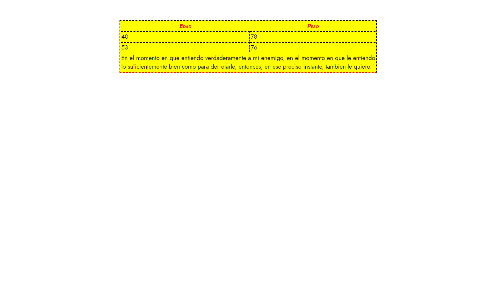

<h1>Taller 9 Santiago Palacios Triana </h1>

<h2> Información</h2>

Curso: full Stack Basico - Grupo 1 

Profesor: Cristian Patiño

<h2> Punto 1: Link figma</h2>
<a href="https://www.figma.com/file/ovvMCtLbyMBw0JsbjzGCn3/Figma-exercise?type=design&node-id=0%3A1&mode=design&t=NoZ8Pe0AqzkPYdQ0-1" target="_blank">Link de Figma</a>

<h3> Link Página Web</h3>
<a href="https://luisaherrerach22.github.io/taller-9-full-stack/"target="_blank">Link página Web</a>
<h2> Punto 2: HTML</h2>

<h2> Punto 3: CSS</h2>

<h2> Punto 4: TÍTULOS</h2>

<h2> Punto 5: ESTILOS DE TEXTO</h2>

<h2> Punto 6: ENLACES</h2>

<h2> Punto 7-8: NAVEGACIÓN</h2>

<h2> Punto 9: TABLAS</h2>

